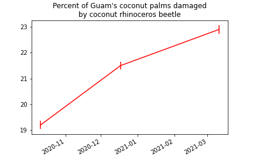

# PRESS RELEASE

Prepared by Aubrey Moore, May 17, 2021

## Bimonthly island-wide roadside video surveys indicate that coconut rhinoceros beetle (CRB) damage to coconut palms is increasing on Guam.



CRB damage surveys use an innovative method developed by UOG entomologist Dr. Aubrey Moore. Roadside videos  are recorded by a smart phone attached to a vehicle. Back in the lab, a computer program developed using an artificial intelligence technique called *deep learning* examines every frame in the videos, finds all coconut trees, assigns a CRB damage to each palm, and generates an interactive map which is published on the internet.


**Screen capture of an online interactive map of coconut rhinoceros beetle damage on Guam. <https://aubreymoore.github.io/Guam-CRB-Damage-Map-2021-03>**

Moore says the new damage survey method is a big improvement over the standard method which requires inspecting individual trees and recording CRB damage levels manually: “We can now measure damage to tens of thousands of palms instead of a few hundred. This means that our damage estimates are much more precise. The data will be used to measure changes in damage in response to CRB pest control activities.”

Moore’s work on monitoring CRB damage on Guam is supported by grants from the US Department of  the Interior – Office of Insular Affairs and the US Forest Service.

**Contact for further information:**
```
Dr. Aubrey Moore
Entomologist
College of Natural and Applied Sciences
University of Guam

email: aubreymoore@triton.uog.edu
Cell: 1-671-686-5664
```
 
